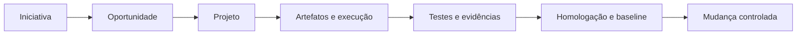

<p align="center">
  
</p>

<h1 align="center">PRISMA SGP</h1>

<p align="center">
  <strong>Sistema de Gestão de Projetos de Software</strong><br>
  Estrutura conectada, decisões rastreáveis e governança proporcional ao contexto.
</p>

<p align="center">
  
  
  
  
</p>

<p align="center">
  
  
  
  
</p>

---

## Sobre o PRISMA SGP

O **PRISMA SGP** é uma plataforma SaaS multiempresa para planejar, executar, documentar e acompanhar projetos de software com rastreabilidade ponta a ponta.

Em um único ambiente, o sistema conecta iniciativas, oportunidades comerciais, projetos, requisitos, tarefas, documentos, contratos, baselines, mudanças, testes, evidências, organizações e auditorias.

> O PRISMA SGP pode apoiar a operacionalização de processos, a rastreabilidade e a produção de evidências úteis em jornadas de melhoria e avaliação MPS.BR. O uso da ferramenta não certifica a organização nem atribui nível de maturidade.

## Situação da versão

| Referência | Situação |
|---|---|
| Release | `v3.0.0`, candidata final |
| Baseline | `BL-SGP-003 · Engenharia Documental Adaptativa` |
| Revisão documental | `2.1` |
| Homologação funcional | Aprovada em 30/08/2026 |
| Validação automatizada | 367 testes e 1.473 asserções aprovadas |
| Branch de integração | `integration/bl3-v3.0.0` |
| Branch de produção | `main`, após promoção controlada |
| Tag planejada | `v3.0.0`, somente no commit efetivamente implantado |
| Identidade visual | Visual vigente preservado; evolução planejada para a BL-SGP-004 |

O congelamento técnico será concluído após a promoção para a `main`, implantação no Laravel Cloud, validação operacional e criação da tag `v3.0.0` no commit publicado.

## O que a plataforma entrega

| Domínio | Capacidades |
|---|---|
| Fundação SaaS | Organizações, isolamento de dados e arquivos, contexto ativo e acesso temporário auditado |
| Gestão de projetos | Projetos, requisitos, tarefas, Kanban, calendário, cronograma e histórico |
| Jornada inicial | Iniciativas, oportunidades, propostas, negociação e conversão controlada em projeto |
| Governança adaptativa | Aplicabilidade proporcional ao contexto, artefatos, revisões e aprovações |
| Gestão contratual | Contratos, capacidade, baselines de projeto e itens congelados |
| Controle de mudanças | Solicitação, análise de impacto, decisão, implementação e rastreabilidade |
| Qualidade | Casos de teste, execuções, evidências, homologação e matriz de rastreabilidade |
| Comunicação | SMTP transacional, filas, diagnóstico sanitizado e teste de entrega |
| Segurança de acesso | Recuperação pública, redefinição administrativa, senha temporária e troca obrigatória |
| Auditoria | Trilha organizacional e auditoria global de segurança exclusiva do Superadmin |

## Fluxo conectado



O fluxo é adaptativo. Projetos internos, demandas diretas, oportunidades comerciais e contratos existentes podem iniciar por caminhos diferentes, preservando a governança necessária para cada contexto.

## Segurança e isolamento

- cadastro público desabilitado;
- autenticação e autorização por perfil global, vínculo organizacional e participação em projeto;
- isolamento lógico de dados, arquivos e trilhas de auditoria por organização;
- contas inativas impedidas de autenticar ou manter sessão ativa;
- arquivos permanentes mantidos em armazenamento privado;
- segredos armazenados somente em variáveis protegidas do ambiente;
- senhas SMTP, tokens e senhas temporárias ausentes de logs e auditorias;
- recuperação de senha com resposta neutra, expiração, uso único e limitação de solicitações;
- eventos globais de segurança separados da auditoria operacional de cada organização.

## Tecnologias

| Camada | Tecnologias principais |
|---|---|
| Backend | PHP 8.2+, Laravel 12, Eloquent ORM e Blade |
| Banco de dados | PostgreSQL 14+ |
| Frontend | Tailwind CSS, Alpine.js e Vite 7 |
| Documentos | PHPWord e Dompdf |
| Armazenamento | Flysystem local ou Object Storage compatível com S3 |
| Comunicação | SMTP transacional e filas Laravel |
| Qualidade | PHPUnit 11, testes automatizados e homologação funcional |
| Entrega | Git, GitHub, Laravel Cloud, branches controladas e tags rastreáveis |

## Instalação local

Os procedimentos completos estão disponíveis em [`INSTALL.md`](INSTALL.md), incluindo PostgreSQL, Object Storage, SMTP, filas, Laravel Cloud, backup, restauração, atualização e retorno de versão.

```powershell
Copy-Item .env.example .env
composer install
php artisan key:generate
npm ci
npm run build
php artisan migrate --seed
php artisan optimize:clear
php artisan serve
```

Quando `QUEUE_CONNECTION=database`, mantenha o trabalhador da fila ativo em outro terminal:

```powershell
php artisan queue:work --tries=3 --timeout=90
```

> Nunca versione o arquivo `.env`, credenciais, tokens, chaves SMTP, logs sensíveis ou backups de desenvolvimento.

## Validação

```powershell
php artisan optimize:clear
php artisan test
npm run build
git diff --check
```

Resultado homologado da candidata final:

```text
Tests: 367 passed
Assertions: 1473
```

A homologação funcional também cobriu os percursos P01 a P09, incluindo SMTP real, recuperação pública de senha, redefinição administrativa, senha temporária, troca obrigatória e auditorias global e organizacional.

## Baselines do produto

| Baseline | Denominação | Situação |
|---|---|---|
| `BL-SGP-001` | MVP | Implementada, homologada e histórica |
| `BL-SGP-002` | Fundação SaaS Multiempresa | Implementada, homologada e histórica |
| `BL-SGP-003` | Engenharia Documental Adaptativa | Implementada e homologada; publicação da `v3.0.0` em fechamento |
| `BL-SGP-004` | Próxima evolução | Não iniciada; escopo sujeito a análise e aprovação |

## Próxima evolução

Os itens abaixo não integram a `v3.0.0`. São direcionadores sujeitos à análise e aprovação da BL-SGP-004:

- aplicação da nova identidade visual do PRISMA SGP;
- evolução da experiência responsiva e do dashboard;
- painel organizacional de qualidade e visão MPS.BR;
- gestão SaaS de planos, assinaturas, limites e módulos;
- tratamento comercial e financeiro do projeto, sem transformar o produto em sistema financeiro;
- integrações com serviços externos e automações;
- assistência contextual com inteligência artificial;
- Wiki, reuniões, atas, Sprints e cronograma avançado.

## Documentação

- [`INSTALL.md`](INSTALL.md): instalação, configuração, operação e atualização;
- [`CHANGELOG.md`](CHANGELOG.md): histórico de mudanças;
- [`RELEASE-v3.0.0.md`](RELEASE-v3.0.0.md): conteúdo e condição da release;
- [`docs/baselines/BL-SGP-003`](docs/baselines/BL-SGP-003): documentação formal da baseline;
- [`06-Encerramento-Homologacao`](docs/baselines/BL-SGP-003/06-Encerramento-Homologacao): homologação, catálogo, promoção e manifesto de integridade.

## Versionamento e governança

- a `main` representa somente código estável e publicável;
- a tag `v3.0.0` deve apontar para o commit efetivamente implantado;
- uma tag histórica não deve ser movida;
- correções posteriores exigem novo commit e versionamento correspondente;
- mudanças de escopo após o congelamento exigem registro e baseline de destino;
- código, migrations, testes, documentos, evidências e release permanecem vinculados.

## Autoria e licença

**Liliane de Freitas Terra Vieira**<br>
Analista de Requisitos, Desenvolvedora e Técnica em Tecnologia da Informação

O PRISMA SGP é software proprietário. Sua cópia, modificação, distribuição, implantação ou comercialização depende de autorização e instrumento contratual aplicável. As dependências de terceiros conservam suas próprias licenças.

<p align="center">
  <strong>PRISMA SGP</strong><br>
  Projetos estruturados. Decisões rastreáveis. Evolução com propósito.
</p>
